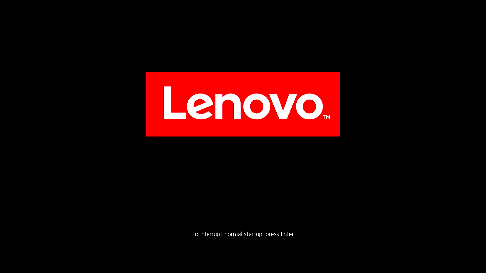
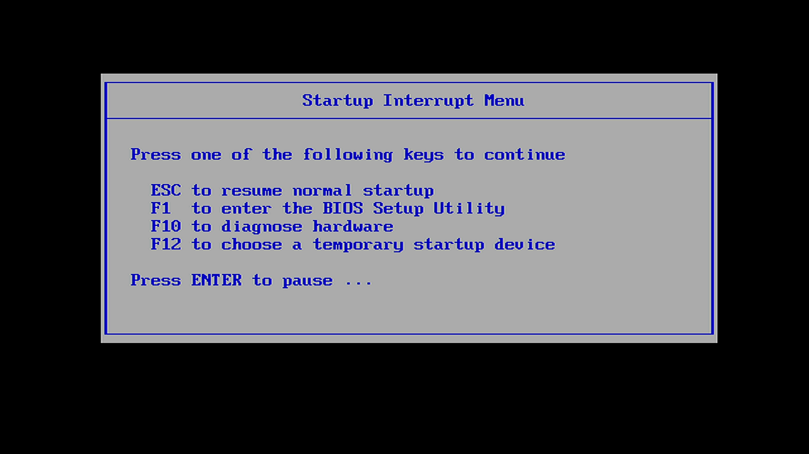

# EN: How to setup laptop with SecureBoot and LUKS
# DE: Einrichten eines Laptops mit SecureBoot und LUKS 

* EN: Here I am collecting my scripts and firmware screenshots that document how I setup my Thinkpad X1 Carbon 5th Generation (20HR002MMX) with custom, personal Secure Boot certificates, running ArchLinux, LinuxMint and Windows10Home / Windows10Pro. 
* DE: Hier sammle ich meine Skripts und Firmware-Bildschirm-Fotos, die dokumentieren, wie ich mein Thinkpad X1 Carbon 5te Generation (20HR002MMX) so eingerichtet habe mit persönlichen, benutzerdefinierten SecureBoot-Zertifikaten, dass darauf sowohl ArchLinux, LinuxMint als auch Windows10Home / Windows10Pro als Betriebssystem laufen. 

## EN: 1. ADDING A UEFI-BIOS FIRMWARE PASSWORD
## DE: 1. HINZUFÜGEN EINES UEFI-BIOS FIRMWARE PASSWORTES

* EN: In order to protect the UEFI / BIOS firmware settings, so that Secure Boot cannot be turned off without a password, it is wise to protect the UEFI / BIOS firmware settings with a password, called "Supervisor Password". 
* DE: Um die UEFI / BIOS Firmware-Einstellungen zu schützen, sodass SecureBoot nicht einfach wieder deaktiviert werden kann ohne ein Passwort, ist es ratsam, die UEFI / BIOS Firmware-Einstellungen mit einem Passwort zu schützen. Dieses Passwort wird "Supervisor Passwort" genannt. 

* EN: Press the power button of your laptop and shortly (!) after that the UEFI-BIOS Setup key(s), which are dependant on your PC manufacturer and model: 
* DE: Drücken Sie den Ein/Aus-Schalt-Knopf und sehr schnell (!) danach die UEFI-BIOS-Einrichtungs-Taste(n), die für jeden PC-Hersteller und jedes PC-Modell anders ist oder sind: 

| EN: UEFI/BIOS Setup key                | EN: Manufacturer or model          |
| -------------------------------------- | ---------------------------------- |
| **DE: UEFI/BIOS-Einrichtungs-Taste**   | **DE: Hersteller oder Modell**     |
| F1                                     | Lenovo Desktop, Lenovo Thinkpads   |
| F2                                     | ASRock, ASUS, Acer, Dell, Gigabyte,|
|                                        | Lenovo Laptops, Toshiba, Samsung,  |
|                                        | Origin PC,                         |
| F10                                    | HP                                 |
| F12                                    | Toshiba Equium                     | 
| DEL / ENTF                             | ASRock, ASUS, ECS, Gigabyte/Aorus, |
|                                        | MSI, Zotac                         |
| Power + VolumeUp                       | Microsoft Surface                  | 

* EN: On many PC's, there is also a UEFI/BIOS Interrupt menu that can be opened by pressing an Interrupt key during boot.  
* DE: Auf vielen PC's gibt es auch ein UEFI/BIOS-Unterbrechungs-Menü, das durch Drücken der Unterbrechungs-Taste während dem Boot-Vorgang aufgerufen werden kann. 
* EN: This UEFI/BIOS Interrupt menu explains which keys are available to open the different UEFI/BIOS options. 
* DE: Dieses UEFI/BIOS-Unterbrechungs-Menü erklärt, welche UEFI/BIOS-Optionen über die Tasten zur Verfügung stehen. 
* EN: This key which opens the UEFI/BIOS Interrupt menu is also different for every manufacturer or model: 
* DE: Diese Taste, die das UEFI/BIOS-Unterbrechungs-Menü öffnet, ist auch für jeden Hersteller und jedes Modell unterschiedlich: 

| EN: UEFI/BIOS Interrupt menu key       | EN: Manufacturer or model          |
| -------------------------------------- | ---------------------------------- |
| **DE: UEFI/BIOS-Unterbrechungs-Taste** | **DE: Hersteller oder Modell**     |
| ENTER / EINGABE                        | Lenovo Thinkpad                    | 

* EN: When the following boot screen is displayed, press the UEFI/BIOS Setup key or UEFI/BIOS Interrupt menu key:  
* DE: Wenn der folgende Boot-Startbildschirm angezeigt wird, drücken Sie die UEFI/BIOS-Einrichtungs-Taste oder die UEFI/BIOS-Unterbrechungs-Taste: 

 

* EN: The UEFI/BIOS Interrupt menu will look similar to his: 
* DE: Das UEFI/BIOS-Unterbrechungs-Menü sieht so ähnlich aus wie dieses: 

 
